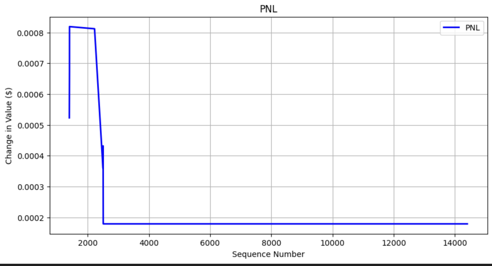

# Machine Learning Paper Trader

This repository implements a real-time cryptocurrency trading simulator that uses logistic regression on market microstructure data to predict short-term price movements. The system spans offline model training in Python and real-time order book inference and execution in C++.

---

## 📊 Research & Model Development

Model development is conducted in [`research.ipynb`](./research.ipynb). The goal is to classify whether the mid-price will move **up** or **down** over the next 20 order book updates using features derived from Level-2 order book snapshots.

### Workflow:

1. **Load Historical Data**  
   Raw order book snapshots are loaded and preprocessed into labeled data.

2. **Feature Engineering**  
   Features include:
   - Bid-ask spread
   - Price and volume at top N levels
   - Log-transformed volumes
   - Order book imbalance
   - VWAP and log VWAP

3. **Model Training**  
   A logistic regression classifier is trained to predict the direction of the mid-price movement (up/down) using the above features.

4. **Export Coefficients**  
   The trained model’s coefficients and intercept are exported to a text file: 20_update_log_classifier.txt

## ⚙️ Real-Time Inference & Trading

The live simulation is performed in C++ by combining:
- A `LogisticRegressionModel` (from exported coefficients)
- WebSocket-based real-time data stream (via `websocket.py`)
- A trading simulation engine (`simulator.cpp`)

### Real-Time Workflow:

1. **Launch WebSocket**
simulator.cpp spawns websocket.py in the background. This Python script:

Connects to the Coinbase WebSocket API

Streams real-time L2 updates for a product like BTC-USD

Writes updates to a named pipe at /tmp/datapipeline

2. **Ingest & Update Order Book**
The C++ simulator reads messages from the pipe, parses the JSON, and updates the order book with orderbook.cpp.

3. **Feature Generation**
Every message triggers the feature generation function in simulator.cpp, which extracts market microstructure features. Done in `feature_engineering()`.

4. **Inference**
These features are passed into the LogisticRegressionModel (from model.cpp) to compute the probability of an upward mid-price movement.

5. **Position Management**

If the probability exceeds a confidence threshold (e.g., 0.6), the simulator simulates a market buy.

It then holds the position for a fixed number of updates (update_lag), then simulates a sell.

Trade details (buy/sell amount, volume, PnL) are stored in position.cpp and logged to a timestamped .csv file in /simulations.

# Machine Learning Paper Trader
## About
This repo is a paper simulator to test the live performance of machine learning binary classifiers for choosing when to buy and sell stocks, cryptocurrencies, and other tradeable assets. This simulator is connected to the Coinbase exchange, but in theory, can be applied to any exchange and any asset class. You can plug and play any machine learning binary classifier to see its performance. The binary classifier should be trained to predict when the mid price will go up, and the simulator will show how accurately it is able to predict upward price movement. It will display the PnL of your model after the simulation.

## Workflow
### Connecting to Exchange
The simulation starts with reading in exchange data through websocket.py. Each exchange has different websocket APIs; currently, websocket.py is configured to read in data from Coinbase exchange. You have to provide your own API name and secret key to connect to each exchange. After the keys are plugged in, the websocket will continually read in updates and place each update into a FIFO file, which is read in by `Simulator` in `simulator.cpp`.
### Updating Orderbook
The `Simulator` processes each update by calling `OrderBook.process_updates(updates)`, which updates `OrderBook`. `OrderBook` contains real-time orderbook data from whichever exchange and asset `WebSocket` is connected to.

### Selling Positions
After the orderbook is updated, we check if any of our active positions have reached their sell time. All active positions are held in `Simulator.positions`, which is made up of `Position`. If 
`Position.sell_sequence_number <= sequence_number`, then the current `Position` is ready to sell. If a `Position` is ready to sell, we pop it from `Simulator.positions`, update `Simulator.pnl`, and log the completed trade (found in simulations folder)l

### Machine Learning Price Movement Prediction and Buying Positions
After expired active positions are sold, we check if the current state of the orderbook might lead to an increase or decrease in mid price. First, we create the inference vector in `feature_engineering`. This function returns our inference vector, with which we call `model.predict_probability(inference_vector)`. This function returns the probability the mid price will increase. If the probability meets the confidence requirement, we place an active `Position` into `Simulator.positions`. Currently, the model predicts if the price will move up in the next 20 updates, meaning if we are currently at sequence number n, we will sell our positions at sequence number n+20.

## Machine Learning & QR
All of the machine learning exists within `model.py` and `research.ipynb`. Feature engineering and model training is done in `research.ipynb`. I am working with a logistic regression model because it can be easily written as an equation that can be plugged into my program. More complex models such as xgboost, randomforest, etc are difficult to translate into into a cpp program.

## Personal Research and Development
The personal research and development I have done can be found in `research.py`. A key factor is the volume of asks and bids that are available within a certain $ `buy_amount`, or market depth. We see how much ask market depth we can buy for $`buy_amount`, and, after `time_lag` updates, we calculate the bid market depth for $`buy_amount`. If the bid market depth is less than the ask market depth for $`buy_amount`, this means the value of the asset increased and selling all of the volume of the asset will result in a profit. 

Feature vectors at inference time are engineered in `time_independent_features()` and `time_dependent_features()`. I focused on several factors related to market depth, volume, vwap, and price. 

Target feature is engineered in `create_time_lag()` and `create_gain_binary()`. `create_time_lag()` shifts the bid market depth column up by n rows. `create_gain_binary()` compares the "Ask Market Depth" value and the "Bid Market Depth Time Lag n" value. If 
"Ask Market Depth" value > "Bid Market Depth Time Lag n", 1 else 0. After the dataset in created, I train a logistic regression model.

I do not include all columns in training. The feature vectors are found in `feature_columns` and the target vector is found in `target_gain`.
After training, I look into the probability breakdown of `X_test`. I find that the best confidence limit is around 0.60 because most ground truth falses are captured under a probability of 0.60. In this environment, the most important factor to limit is false positives. Most false positives are under the probility of 0.60. While a 0.60 confirence limit also introduces high levels of false negatives, we have less concern for false negatives because a negative probability means we do not buy, so we do not exposure our position for loss. A false positive exposes us to loss. We want to limit false positives, maximize true positives, and 0.60 seems like a good limit.

Letting my model run, here is the PnL
  
  
  